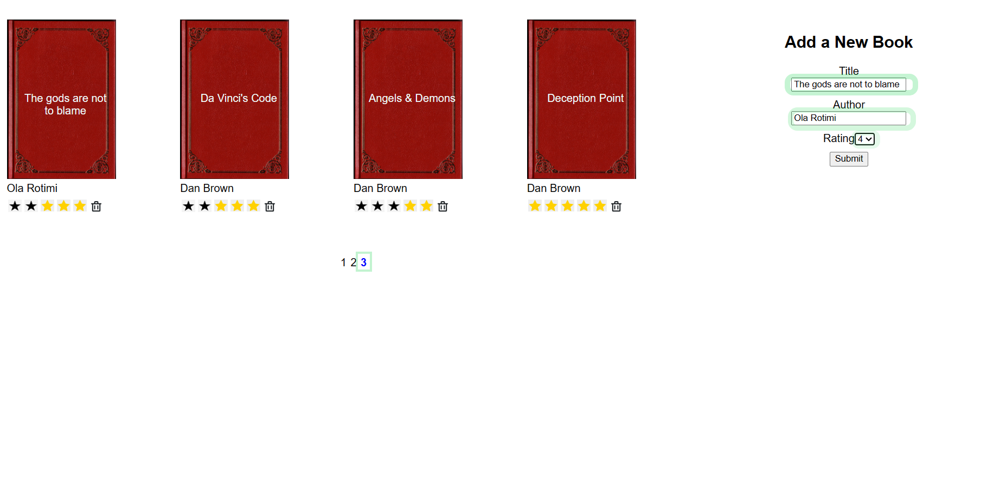
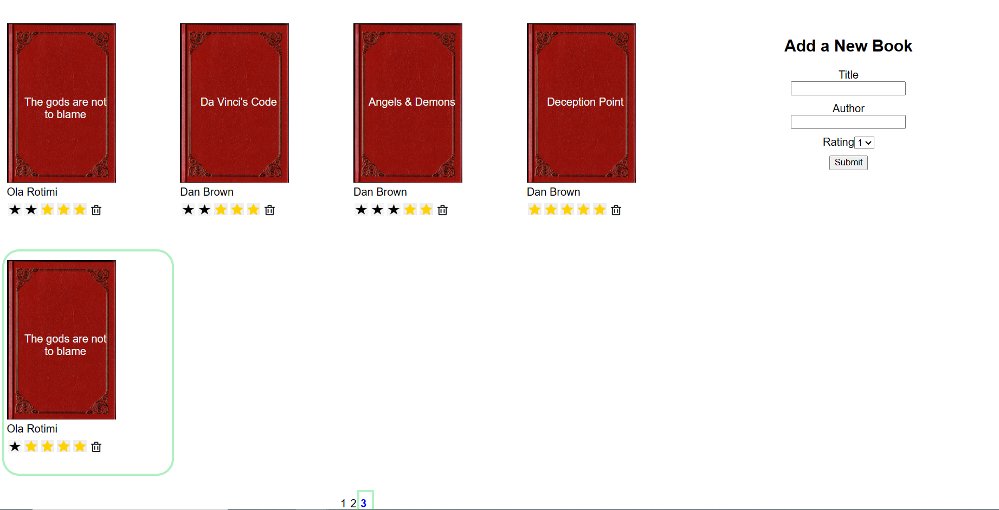
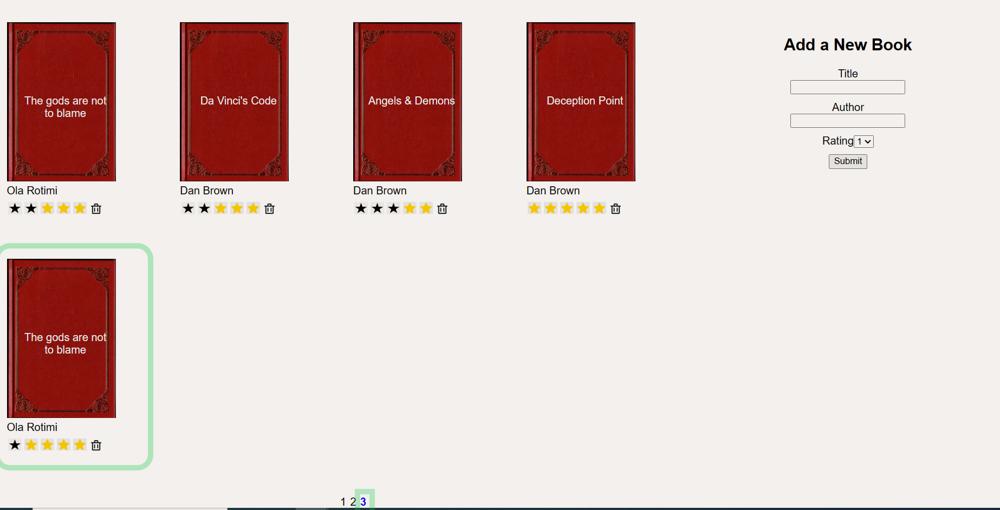
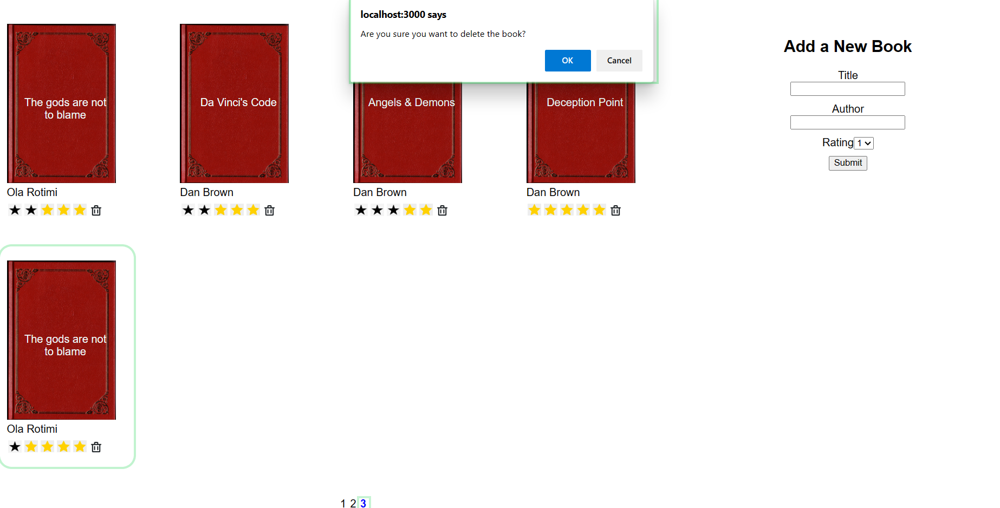
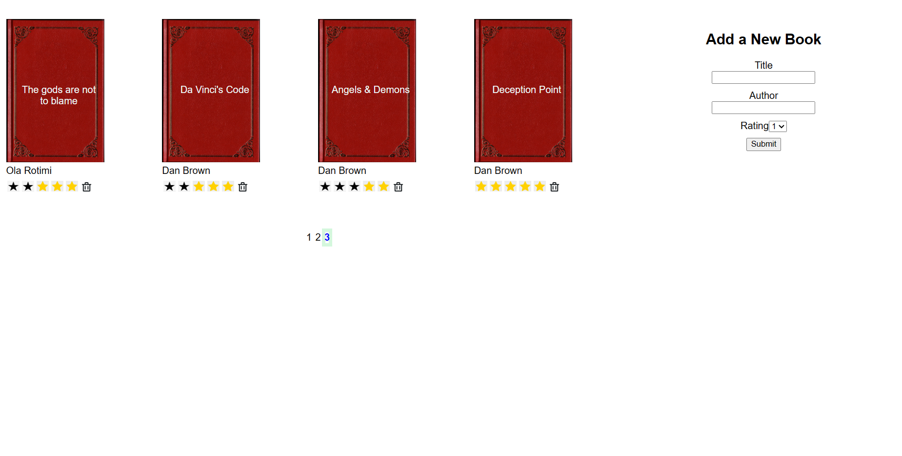

# API Development and Documentation Final Project

## Bookshelf API App

The Bookshelf API app displays some cool novels you should check out if you haven't read them yet. It allows users to see all the books in the bookshelf paginated by **EIGHT**. Users can add new books, edit a book's ratings and/ or delete existing book(s).

**Home Page**


## What can you do with this App?

The Bookshelf API app has the following functionalities. It allows users to:

1. View all books; eight books per page. Books should show the title of the book, author of the book, ratings and trash can to delete a book entry.
2. Delete books.
3. Add new book and require that they include title, author and ratings.
4. Update an existing book's ratings

# Getting Started

### The Frontend

The [frontend](./frontend) directory contains a complete React frontend to consume the data from the Flask server.

> _tip_: this frontend is designed to work with [Flask-based Backend](../backend) so it will not load successfully if the backend is not working or not connected. It is advisable to **stand up the backend first**, you can then test using Postman or curl.

#### Installing Dependencies

1. **Installing Node and NPM**
   This project depends on Nodejs and Node Package Manager (NPM). Before continuing, you must download and install Node (the download includes NPM) from [https://nodejs.com/en/download](https://nodejs.org/en/download/).

2. **Installing project dependencies**
   This project uses NPM to manage software dependencies. NPM Relies on the package.json file located in the `frontend` directory of this repository. After cloning, open your terminal and run:

```bash
npm install
```

> _tip_: `npm i` is shorthand for `npm install``

## Required Tasks

### Running Your Frontend in Dev Mode

The frontend app was built using create-react-app. In order to run the app in development mode use `npm start`.

Open [http://localhost:3000](http://localhost:3000) to view it in the browser. The page will reload if you make edits.

```bash
npm start
```

### The Backend

The [backend](./backend) directory contains a complete Flask App, running on the Flask server.

#### Installing Dependencies

1.  **Python 3.7**

    Follow instructions to install the latest version of python for your platform in the [python docs](https://docs.python.org/3/using/unix.html#getting-and-installing-the-latest-version-of-python)

2.  **Virtual Enviornment**

    We recommend working within a virtual environment whenever using Python for projects. This keeps your dependencies for each project separate and organaized. Instructions for setting up a virual enviornment for your platform can be found in the [python docs](https://packaging.python.org/guides/installing-using-pip-and-virtual-environments/)

3.  **PIP Dependencies**

    Once you have your virtual environment setup and running, install dependencies by navigating to the `/backend` directory and running:

```bash
pip install -r requirements.txt
```

This will install all of the required packages necessary for your Flask App.

##### Key Dependencies

- [Flask](http://flask.pocoo.org/) is a lightweight backend microservices framework. Flask is required to handle requests and responses.

- [SQLAlchemy](https://www.sqlalchemy.org/) is the Python SQL toolkit and ORM we'll use to handle our PostgreSQL database.

- [Flask-CORS](https://flask-cors.readthedocs.io/en/latest/#) is the extension we'll use to handle cross origin requests from our frontend server.

## Database Setup

With Postgres running and from the `backend` directory, run the following in the terminal in order to restore the database:

```bash
psql bookshelf < books.psql
```

## Running the backend server

Ensure you are working in your virtual environment.
Navigate to your `backend` directory, open terminal and run the server by executing the commands:

```bash
export FLASK_APP=flaskr
export FLASK_ENV=development
flask run
```

For windows, run this instead:

```bash
set FLASK_APP=flaskr
set FLASK_ENV=development
flask run
```

Setting the `FLASK_ENV` variable to `development` will detect file changes and restart the server automatically.

Setting the `FLASK_APP` variable to `flaskr` directs flask to use the `flaskr` directory and the `__init__.py` file to find the application.

## Tasks

| No  | Completed | Task Description                                                                                                                                                  |
| :-- | :-------: | :---------------------------------------------------------------------------------------------------------------------------------------------------------------- |
| 1.  |  **[x]**  | Use Flask-CORS to enable cross-domain requests and set response headers.                                                                                          |
| 2.  |  **[x]**  | Create an endpoint to handle GET requests for books, including pagination (every 8 books). This endpoint should return a list of books and total number of books. |
| 3.  |  **[x]**  | Create an endpoint to DELETE a book using the book ID.                                                                                                            |
| 4.  |  **[x]**  | Create an endpoint to POST a new book, which will require the title, author and book ratings.                                                                     |
| 5.  |  **[x]**  | Create an endpoint to update an existing book's ratings. Method could be POST or PATCH.                                                                           |
| 6.  |  **[x]**  | Create error handlers for all expected errors including 400, 404, 422 and 500.                                                                                    |
| 7.  |  **[x]**  | Write at least one test for each test for successful operation and for expected errors.                                                                           |

## API

GET `/books`
Fetches a paginated dictionary of all available books

- _Request parameters (optional):_ page:int
- _Example response:_

```{
    "books": [
        {
            "author": "Ola Rotimi",
            "id": 55,
            "rating": 3,
            "title": "The gods are not to blame"
        },
        {
            "author": "Dan Brown",
            "id": 58,
            "rating": 5,
            "title": "Deception Point"
        }
    ],
    "success": true,
    "total_books": 20
}
```

DELETE `/books/<book_id>`
Delete an existing book from the repository of available books.

- _Request arguments:_ book_id:int
- _Example response:_

```
{
    "books_remaining": [
        {
            "author": "Kristin Hannah",
            "id": 3,
            "rating": 4,
            "title": "The Great Alone"
        },
        {
            "author": "Dan Brown",
            "id": 56,
            "rating": 3,
            "title": "Da Vinci's Code"
        },
    ],
    "deleted_book_id": 58,
    "success": true,
    "total_books_remaining": 19
}
```

POST `/books`
Add a new book to the repository of available books

- _Request body:_ {id:int, title:string, author:string, rating:int}
- _Example response:_

```
{
    "books": [
        {
            "author": "Stephen King",
            "id": 1,
            "rating": 5,
            "title": "The Outsider: A Novel"
        },
        {
            "author": "Madeline Miller",
            "id": 8,
            "rating": 5,
            "title": "CIRCE"
        }
    ],
    "created": 62,
    "success": true,
    "total_books": 20
}
```

POST `/books/<book_id>`
Updates an existing book's ratings.

- _Request body:_ book_id:int
- _Example response:_

```
{
    "book_id": 1,
    "success": true,
    "updated_rating": 1
}
```

## Testing

To run the tests, run

```
dropdb bookshelf_test
createdb bookshelf_test
psql bookshelf_test < books.psql
python test_books_api.py
```

## License

[](https://opensource.org/licenses/MIT)

## Author

- [Benedict Ayamga](https://github.com/ayamgabenedict)

## Acknowledgements

- [Udacity](https://www.udacity.com/) The project was developed as a part of Udacity's Full Stack Nanodegree Program.

## Screenshots

**Add book**





**Update a book**


**Delete a book**



